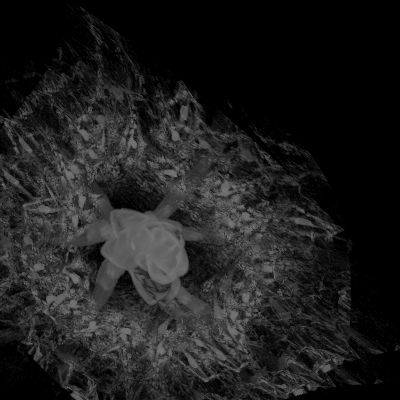

# three-mouse-distortion

基於 Three.js 的可重複使用滑鼠擾動效果，適用於影片或圖片背景。

將滑鼠移過影片或圖片，觸發流體位移與色差視覺效果。

## 預覽

<!-- 建議放一張 GIF 或截圖 -->

## 功能特色

- 滑鼠驅動的流體擾動效果
- 支援影片（`<video>`）與圖片（``）來源，依元素型別自動偵測
- 色差效果（RGB 三通道分離）
- 自動適應容器尺寸（行為類似 `object-fit: cover`）
- 響應式，自動處理視窗縮放
- 所有參數皆可自訂
- 提供 `destroy()` 方法清除資源，適合 SPA 使用

## 使用方式

**HTML**

```html
<!-- 影片來源 -->
<section class="hero">
    <video class="hero-video" autoplay muted loop playsinline>
        <source src="./assets/video.mp4" type="video/mp4" />
    </video>
</section>

<!-- 圖片來源 -->
<section class="hero">
    
</section>
```

**CSS**

```css
.hero {
    position: relative;
    width: 100%;
    height: 100svh;
    overflow: hidden;
}

.hero-video,
.hero-img {
    position: absolute;
    inset: 0;
    width: 100%;
    height: 100%;
    object-fit: cover;
}

.hero-canvas {
    position: absolute;
    inset: 0;
    width: 100%;
    height: 100%;
    z-index: 1;
}
```

**JavaScript**

```js
import { MouseDistortion } from "./MouseDistortion.js";

// 第二個參數傳 <video> 或  皆可，內部會自動判斷來源型別
const distortion = new MouseDistortion(
    document.querySelector(".hero"),
    document.querySelector(".hero-video"), // 或 .hero-img
);

// 離開頁面或元件卸載時清除資源
// distortion.destroy();
```

## 參數說明

所有參數皆為選填，未傳入時使用預設值。

| 參數           | 型別     | 預設值  | 說明                                   |
| -------------- | -------- | ------- | -------------------------------------- |
| `gridSize`     | `number` | `20`    | 擾動場解析度，越高越細緻，但越耗效能   |
| `mouseRadius`  | `number` | `0.25`  | 滑鼠影響半徑，相對於 `gridSize` 的比例 |
| `strength`     | `number` | `0.1`   | 擾動強度                               |
| `relaxation`   | `number` | `0.925` | 每幀衰減速率，越接近 `1` 拖尾越長      |
| `displacement` | `number` | `0.015` | UV 偏移的最大幅度，控制畫面扭曲程度    |
| `aberration`   | `number` | `0.15`  | 色差強度                               |

```js
const distortion = new MouseDistortion(
    document.querySelector(".hero"),
    document.querySelector(".hero-video"),
    {
        gridSize: 30,
        aberration: 0.3,
        relaxation: 0.95,
    },
);
```

## 依賴套件

- [Three.js](https://threejs.org/) r180+

範例使用 CDN 引入。若搭配打包工具使用：
